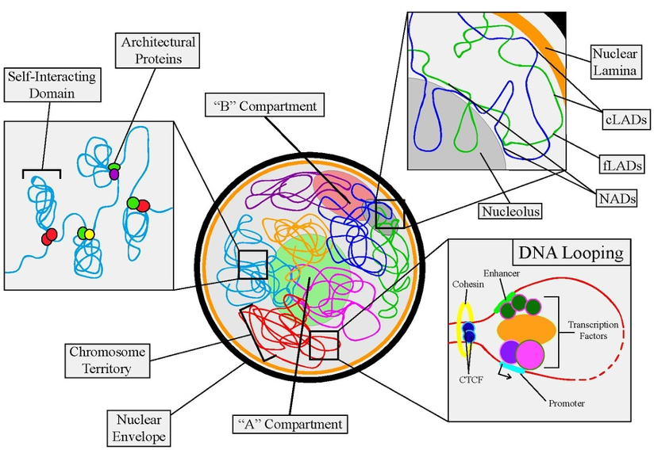
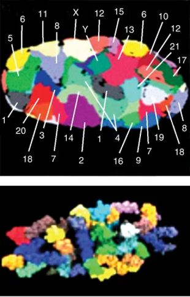
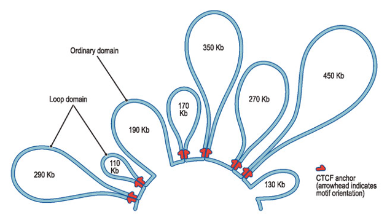
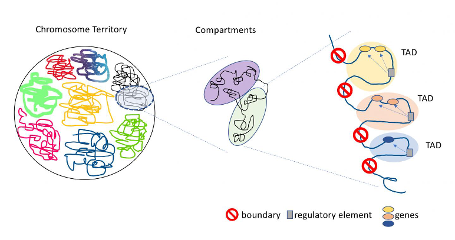
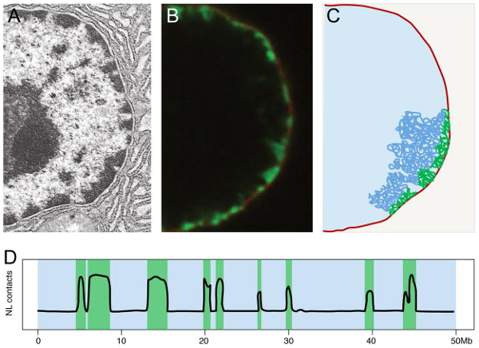
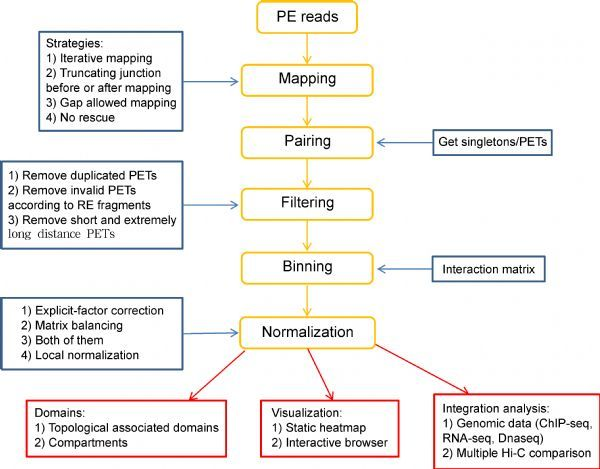
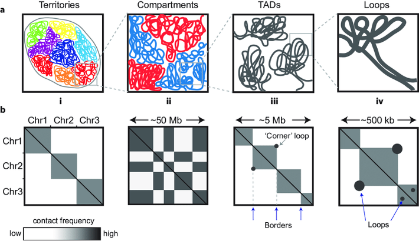

# 3D Genome Structure And Hi-C Analysis
1. [Introduction](#231)
2. [3D Chromosome Structure](#232) 
    2.1. [Chromosomal Territories](#2321) 
    2.2. [A/B Compartment](#2322) 
    2.3. [Chromatin Loops](#2323) 
    2.4. [TADs](#2324) 
    2.5. [LADs](#2325) 
    2.6. [NADs](#2326)
3. [Hi-C Analysis](#233)
4. [Real-life Example](#234)

## 1. Introduction 

From a 3D perspective, the genome has different genomic conformation, showing different interaction patterns that can be revealed by Hi-C results. 
The Larger scale conformations are structures like: chromosome territories and A/B compartments. 
The smaller scale conformations are structures like: loop, TADs, LADs, etc.
 [[1]](https://en.wikipedia.org/wiki/Nuclear_organization)

## 2. 3D Chromosome Structure 

 Schematic Representation of Chromosome Conformation Capture (3C) and 3C-Derived Methods. These methods help to elucidate nuclear organization by detecting physical interactions between genetic elements located throughout the genome. Abbreviations: IP, immunoprecipitation; RE, restriction enzyme. [[2]](https://doi.org/10.1016/j.tplants.2018.03.014)

To better understand the difference between these methods, I'd like to distingush them between the following couple of aspects:

#### 1) Large Conformations - Chromosomal Territories
Each chromosome occupies specific regions of the nucleus, forming individual territories and rarely intermix. As a result, the interaction between loci on the same chromosome is more frequent. The chromosomal territory helps regulate gene expression by redistributing genes and co-localizing genes with their transcription machinery.

#### 2) Large Conformations - A/B Compartments
The whole genome can be separated into two self-interacting spatial compartments: A and B. Usually, the A compartments tend to be gene-rich and contain histone markers for active transcription. In other words, A compartments are open and expression-active chromatins. B compartments, on the other hand, tend to be gene-poor and contain histone markers for gene silencing. In general, B compartments are closed and expression-inactive chromatins. Usually, we expect interactions between loci to occur within the same compartment. Regions in compartment A tend to interact with regions in compartment A, and regions in compartment B tend to interact with regions in compartment B. 

#### 3) Small Conformations - Chromatin Loops
Genome forms a loop structure to bring together two far away elements to a spatial proximity in order to facilitate regulatory effect.
A loop is a site where a protein specifically binds to two different sequences in the genome. As a result, we can see strong associations/interactions between these sites. 

#### 4) Small Conformations - Topologically Associating Domains
TADs are self-interacting genomic regions. DNA sequences interact with each other more frequently within TADs. Many studies indicate that TADs restrict interactions of regulatory sequences to their target genes. Moreover, TAD boundaries are associated with high CTCF binding and more frequent appearance of certain genes such as the housekeeping genes. However, the function of TADs is still not fully understood and we need more research. According to the computer simulation, we find that chromatin loop extrusion can help generate TADs through cohesin motors.

#### 5) Small Conformations - Lamin Associated Domains
Genomic regions that are adjacent to the nuclear lamina, in which DNA heavily interacts with NL and form a condensed chromatin layer. LADs are associated with gene repression because the post-translational histone modification, H3K27me3, is enriched in LADs chromatin. 

#### 6) Small Conformations - Nucleolar Associated Domains
NADs are regions in which DNA sequences interact with nucleolus. This structure, frequently including large multi-gene clusters, usually express characteristics of constitutive heterochromatin and are correlated with low gene expression. The part of the chromosome that contains ribosomal RNA genes is usually inside the NADs. NADs can be further differentiated into two types. Type I NADs are usually associated with both nucleolar periphery and nuclear lamina. This type of NADs are usually constitutive heterochromatin, leading to late DNA replication and little gene expression. Type II NADs are usually associated with nucleoli. This type of NADs, in contrast, leads to earlier DNA replication and greater gene expression. (Saksouk et al.)

## Hi-C:

#### PipeLine:

#### Introduction to HiC data mapping format:

The graphs here show the general shape of mapping of the data from a larger scale to the smaller scale. As we can see in the graph: the x and y axis represent the sequence of the part of the genome we are looking at, and they are identical. The intensity of the shadow represents the contact frequency of two positions on the sequence. That’s why we have a completely dark line that goes from top left to bottom right. The line is at the position where the sequence of x and y is at the same position. The gray square on the graph represents a self-interacting genomic sequence. As explained above, chromosome territories, A/B compartments and TADs all have this property. Moreover, for the loops, we can see that it is at the corner of some TADs, and it is very dark.  We also observe that the corner of the TAD represents the contact frequency of its head and tail, so we understand that the loop is formed by the head and tail of this TAD interacting with each other. The part of chromatin bends to make this interaction happen while also bringing other parts to each other. That’s why these TADs are also called loop domains.

## 3. Hi-C Analysis
Hi-C is the highest through-put version of 3C-derived technologies. Due to the decreasing cost of 2nd generation sequencing, hi-c is widely used.

The principle of Hi-C can be illustrated as:

##### Hi-C critical steps [8] 
- Fixation: keep DNA conformed
- Digestion: enzyme frequency and penetratin
- Fill-in: biotin for junction enrichment
- Ligation: freeze interactions in sequence
- Biotin removal: junctions only
- Fragment size: small fragments sequence better
- Adapter ligation: paired-end and indexing
- PCR: create enough material for flow cell

##### Hi-C derived techniques 
- Hi-C original: [Lieberman-Aiden et al., Science 2010](doi: 10.1126/science.1181369)
- Hi-C 1.0: [Belton-JM et al., Methods 2012](doi: 10.1016/j.ymeth.2012.05.001)
- In situ Hi-C: [Rao et al., Cell 2014](doi: 10.1016/j.cell.2014.11.021)
- Single cell Hi-C: [Nagano et al., Genome Biology 2015](https://doi.org/10.1186/s13059-015-0753-7)
- DNase Hi-C [Ma, Wenxiu, Methods et al](https://www.ncbi.nlm.nih.gov/pubmed/25437436)
- Hi-C 2.0: [Belaghzal et al., Methods 2017](https://www.ncbi.nlm.nih.gov/pubmed/28435001)
- DLO-Hi-C: [Lin et al., Nature Genetics 2018](https://doi.org/10.1038/s41588-018-0111-2)
- Hi-C improving: [Golloshi et al., Methods 2018](https://www.biorxiv.org/content/biorxiv/early/2018/02/13/264515.full.pdf)
- Arima 1-day Hi-C: [Ghurye et al., BioRxiv 2018](https://www.biorxiv.org/content/early/2018/02/07/261149)

## 4. Real-life Example 
This paper looks at 3D epigenome reprogramming during pancreatic cancer metastasis.
They compared 3D epigenome structure between non-metastatic (primary cancer cells) and metastatic pancreatic cancer cells.
With Hi-C, they are able to identify, for example, changes in A/B compartment, contact domains, and chromatin loops in the metastatic samples. Specifically, this figure shows the emergence of enhancer-promoter loops that are specific to metastatic cells.
 
The figures above are Hi-C contact heat maps from primary cancer cells (left) and metastatic cancer cells (right). Compared to the primary sample, the metastatic sample has additional red points labeled by black arrows. As introduced above, these are DNA loops. For example, there are enhancers looped to the KLF5 promoter region in metastatic cancer cells, which cannot be found in primary cancer cells on the left. According to Ren et al., these metastasis-specific loops can mediate additional enhancer-promoter loops to upregulate genes associated with pancreatic cancer metastasis. (Ren et al.) 

This example demonstrates the significance of Hi-C analysis: it helps to identify 3D epigenome reprogramming during pancreatic cancer metastasis and expand our knowledge of mechanisms of gene regulation during pancreatic cancer metastasis.

## 2.3.5 Selected methods comparison 
<table>
 <tbody>
    <tr>
        <th>Method</td>
        <th>Targets</td>
        <th>Resolution</td>
        <th>Notes</td>
    </tr>
    <tr>
        <td>3C <a href="http://refhub.elsevier.com/S2001-0370(17)30093-4/rf0535">[3]</a></td>
        <td>one-vs-one</td>
        <td>~1–10 kb </td>
        <td><ul><li>Sequence of bait locus must be known</li><li>Easy data analysis</li><li>Low throughput</li></ul></td>
    </tr>
    <tr>
    <td>4C <a href="http://refhub.elsevier.com/S2001-0370(17)30093-4/rf0545">[4]</a></td>
    <td>one-vs-all</td>
    <td>~2 kb</td>
    <td><ul><li>Sequence of bait locus must be known</li><li>Detects novel contacts</li><li>Long-range contacts</li></ul></td>
    </tr>
    <tr>
    <td>5C <a href="http://refhub.elsevier.com/S2001-0370(17)30093-4/rf0550">[5]</a></td>
    <td>many-vs-many</td>
    <td>~1 kb</td>
    <td><ul><li>High dynamic range</li><li>Complete contact map of a locus</li><li>3C with ligation-mediated amplification (LMA) of a ‘carbon copy’ library of oligos designed across restriction fragment junctions of interest
3C</li></ul></td>
    </tr>
    <tr>
    <td>Hi-C <a href="http://refhub.elsevier.com/S2001-0370(17)30093-4/rf0300">[6]</a></td>
    <td>all-vs-all</td>
    <td>0.1–1 Mb</td>
    <td><ul><li>Genome-wide nucleosome core positioning</li><li>Relative low resolution</li><li>High cost</li></ul></td>
    </tr>
    <tr>
    <td>ChIA-PET <a href="http://refhub.elsevier.com/S0168-9525(15)00063-3/sbref1405">[7]</a></td>
    <td>Interaction of whole genome mediated by protein</td>
    <td>Depends on read depth and the size of the genome region bound by the protein of interest</td>
    <td><ul><li>Lower noise with ChIP</li><li>Biased method since selected protein</li></ul></td>
    </tr>
 </tbody>
</table>

# Referrence
[1] “Nuclear Organization.” Wikipedia, Wikimedia Foundation, 20 June 2022, https://en.wikipedia.org/wiki/Nuclear_organization. 
 

[2] Sotelo-Silveira, Mariana, et al. “Entering the next Dimension: Plant Genomes in 3D.” Trends in Plant Science, vol. 23, no. 7, 2018, pp. 598–612.,https://doi.org/10.1016/j.tplants.2018.03.014. 

[3] Dekker J, Rippe K, Dekker M, Kleckner N. Capturing chromosome conformation. Science 2002;295(5558):1306–11. 

[4] Simonis M, Klous P, Homminga I, Galjaard RJ, Rijkers EJ, Grosveld F, et al. High-res- olution identification of balanced and complex chromosomal rearrangements by 4C technology. Nature Methods 2009;6(11):837–42. 

[5] Dostie J, Richmond TA, Arnaout RA, Selzer RR, Lee WL, Honan TA, et al. Chromo- some Conformation Capture Carbon Copy (5C): a massively parallel solution for mapping interactions between genomic elements. Genome Res 2006;16(10): 1299–309. 

[6] Lieberman-Aiden E, van Berkum NL, Williams L, Imakaev M, Ragoczy T, Telling A, et al. Comprehensive mapping of long-range interactions reveals folding principles of the human genome. Science 2009;326(5950):289–93. 

[7] Fullwood, M.J. et al. (2009) An oestrogen-receptor-alpha-bound human chromatin interactome. Nature 462, 58–64. 

[8] https://github.com/hms-dbmi/hic-data-analysis-bootcamp/blob/master/HiC-Protocol.pptx.

